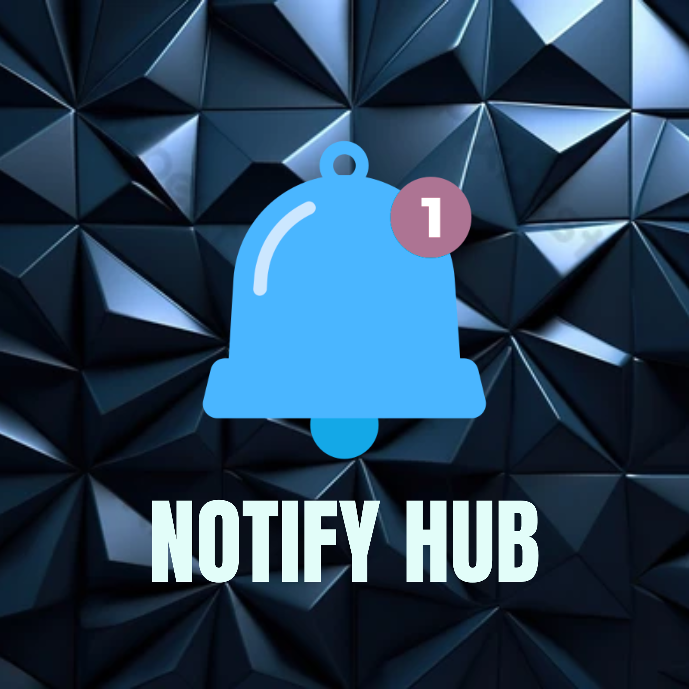
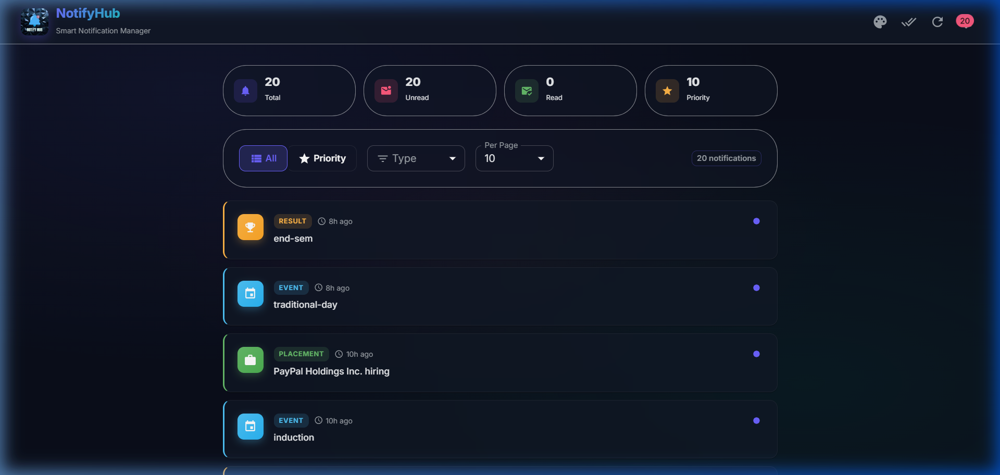
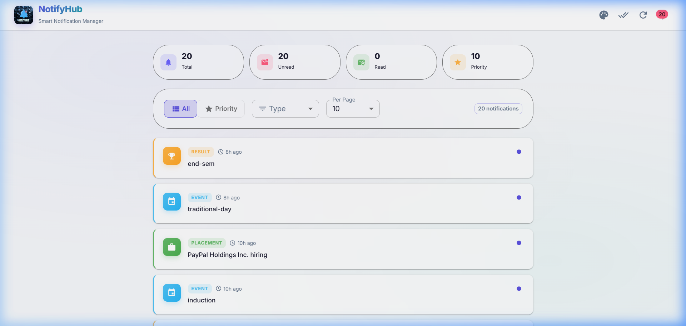
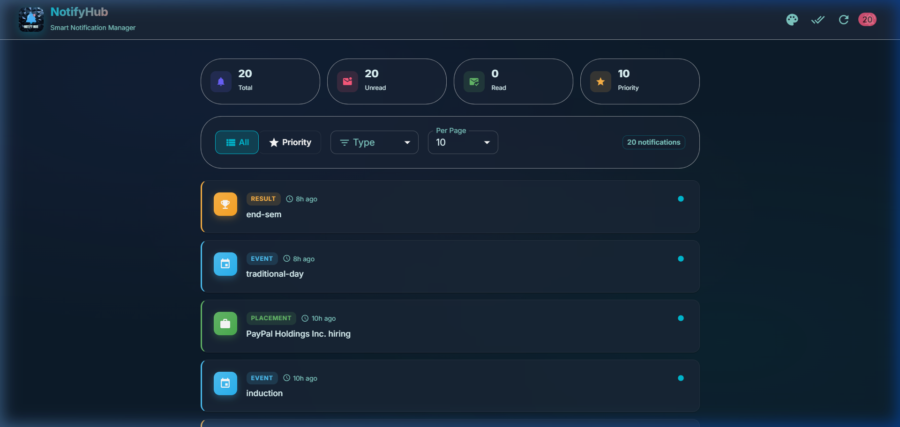
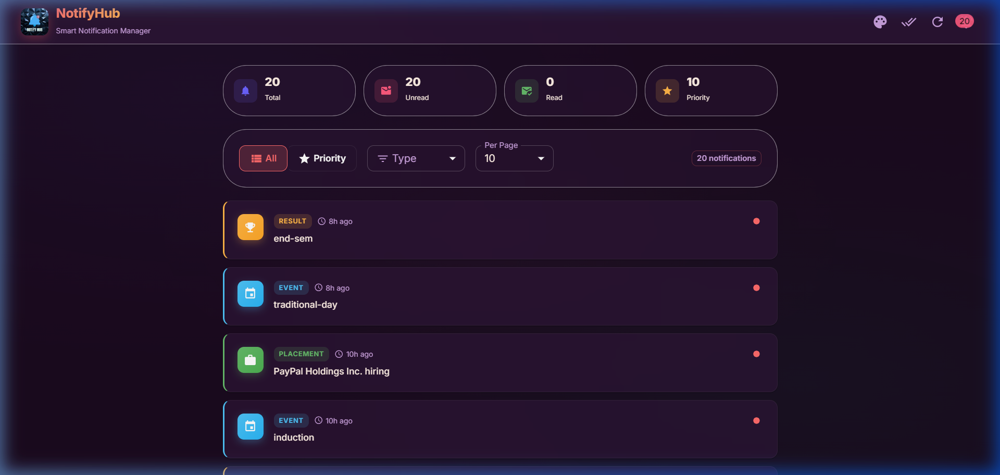

<p align="center">
  
</p>

<h1 align="center">NotifyHub</h1>
<p align="center">a notification management app built with react, typescript and material ui for the affordmed campus hiring evaluation.</p>

---

## screenshots

### dark theme (default)


### light theme


### ocean theme


### sunset theme


---

## what it does

- fetches notifications from the evaluation api
- shows them in a nice list with type badges (event, placement, result)
- you can filter by type, paginate, mark as read/unread
- toggle between all notifications and top 10 priority ones
- has a theme switcher (dark, light, ocean, sunset, forest)
- logging middleware sends structured logs to the api

## how to run

1. clone the repo
2. go into the frontend folder

```
cd notification_app_fe
npm install
```

3. copy the env file and fill in your credentials

```
cp .env.example .env
```

open .env and put your clientID, clientSecret, email, name, roll number and access code

4. start the app

```
npm run dev
```

it opens on http://localhost:3000

## getting your credentials

if you dont have clientID and clientSecret yet, run:

```
node register.cjs
```

this will hit the register api and print your clientID and clientSecret. put them in .env

to test auth separately:

```
node auth.cjs
```

## folder structure

```
root/
├── logging_middleware/     -> the logger
├── notification_app_fe/   -> react app
├── notification_app_be/   -> placeholder (frontend track)
├── screenshots/           -> app screenshots
├── notification_system_design.md
├── README.md
└── .gitignore
```

inside notification_app_fe/src:

- components/ - all the ui pieces (header, cards, filters, etc)
- hooks/ - useNotifications and useAuth
- pages/ - main notification page
- utils/ - api calls and the sorting/topN algorithm
- theme.ts - multi theme setup

## tech used

- react 19
- typescript
- vite
- material ui v9
- axios
- react router

## features

- dark/light/ocean/sunset/forest themes
- custom logo
- notification type filtering with query params
- pagination with query params
- read/unread tracking in frontend state
- priority notifications using a min heap algorithm
- logging middleware used everywhere in the app
- responsive design
- auth token stored in memory not localstorage

## notes

- the api sometimes returns PascalCase fields (ID, Message, Type, Timestamp) so the parser handles both cases
- vite proxy is used to avoid cors issues during dev
- theme preference is saved in session storage
