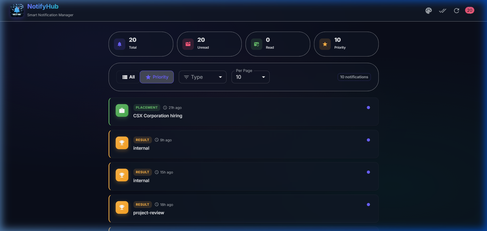

# Stage 1

## how i get the top 10 priority notifications

there are 3 types of notifications the api gives: placement, result, event

i rank them like this:
- placement = highest priority (weight 3)
- result = medium priority (weight 2)
- event = lowest priority (weight 1)

so when you click the priority toggle, placements always show up first, then results, then events. within the same type, newer ones come first.

## how it works with new notifications

the api sends new notifications every time you fetch. to keep the top 10 without re-sorting the whole list every time, i used a min-heap.

the min-heap works like this:
- it holds 10 notifications max
- each notification gets a score = (type weight * big number) + timestamp
- when a new one comes in:
  - if the heap has less than 10, just add it
  - if the new one has a higher score than the lowest in the heap, replace it
  - otherwise skip it
- this way we only do log(10) work per notification instead of sorting everything

the code is in `notification_app_fe/src/utils/notificationAlgorithm.ts`

## priority output

this is what the priority view looks like. placements show first, then results, then events:

## logging middleware

every action in the app gets logged using the `Log()` function. it takes 4 params: stack, level, package, message. all values are forced to lowercase before sending to the api.

logs are batched (5 at a time) and sent to `/api/logs` with the auth token.

the code is in `logging_middleware/logger.ts`
